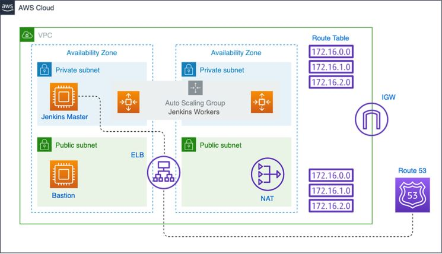

# Provisioning Jenkins Infrastructure with Terraform & Dyanmic Jenkins workers scaling with AWS Auto Scaling

## Part 1: Provisining a single Jenkins instance

### steps:
1. Provisioning an AWS VPC 
2. Creating VPC bastion host
3. Setting up a self-healing Jenkins master on EC2 instance
4. Declaring Elastic Load Balancer resource with health checks
5. Running Jenkins with native SSL/HTTPS using AWS Certificate Manager (ACM)
6. Creating Route 53 'A' record: Can skip if no hosted zone in Route 53

The above figure summarizes the deployed architecture.

### Part 2: Provisioning Dynamically autoscaling the Jenkins worker pool

Running a cluster of Jenkins workers and adjust the size of the cluster up or down based on resource utilization. We can certainly deploy Jenkins workers as separate EC2 instances (rerunning the previous steps). However, we want the instances to be deployed and replaced automatically for autorecovery. That's why we will rely on a standard AWS feature called Auto Scaling Groups.

### steps:
1. Create a launch configuration resource with user dataS
2. Deploying an Auto Scaling Group
3. Defining Autoscaling policies based on CPU utilization using Cloudwatch metrics alarms

